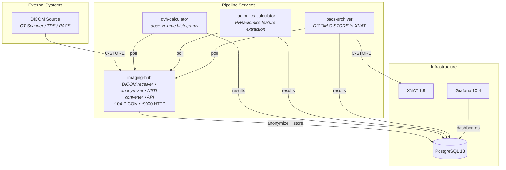

# Medical Imaging Pipeline

A modular pipeline for receiving, anonymizing, converting, and analyzing radiotherapy DICOM data.

## Prerequisites

- **Docker** (with Compose v2) and at least **4 GB RAM** available to Docker
- **[just](https://github.com/casey/just)** — task runner (recommended; all commands below use it)
- **Git**

No other tools or runtimes are required. All services are built inside Docker.

## Quick Start

```bash
git clone git@github.com:mdw-nl/medical-imaging-platform.git
cd medical-imaging-platform

# Copy the environment file, then fill in the REQUIRED passwords
cp deploy/.env.example deploy/.env
$EDITOR deploy/.env     # <-- fill in every line marked "# REQUIRED"

# Build and start the full stack
cd deploy
just up

# Verify services are running
just ps
```

Wait ~15 seconds for PostgreSQL to become healthy and services to start, then you can send DICOM data. XNAT takes longer to initialize (~2 minutes) but the pipeline services don't depend on it.

### Sending Test Data

```bash
just send-dicom /path/to/dicom/data
```

Or using any DICOM sender (e.g. dcm4che `storescu`):

```bash
storescu localhost 104 /path/to/dicom/folder
```

### Monitoring

- **Grafana dashboard**: http://localhost:3000 (credentials from `GRAFANA_USER` / `GRAFANA_PASSWORD` in `.env`)
- **XNAT web UI**: http://localhost:8080 (credentials from `XNAT_ADMIN_USER` / `XNAT_ADMIN_PASSWORD` in `.env`)
- **Service logs**: `just logs imaging-hub`

## Important: Patient Lookup

The imaging-hub anonymizes incoming DICOM by mapping original PatientIDs to new identifiers using `recipes/patient_lookup.csv`. **If a patient ID is not in this file, the DICOM file will fail anonymization and be dropped.**

The file baked into the image (`services/imaging-hub/recipes/patient_lookup.csv`) contains example entries. For your own data, you have two options:

**Option A** — Mount a custom lookup file (recommended for projects):

```yaml
# In your docker-compose.yml
volumes:
  - ./my_patient_lookup.csv:/app/deploy/recipes/patient_lookup.csv
```

**Option B** — Add patient IDs before building:

Edit `deploy/recipes/patient_lookup.csv` directly:

```csv
original,new
YOUR_PATIENT_001,ANON_001
YOUR_PATIENT_002,ANON_002
```

The `original` column must match the PatientID in your DICOM files. The `new` column is the anonymized ID that will appear in the output.

Similarly, `recipes/uuids.txt` can restrict processing to specific StudyInstanceUIDs. If the file is empty (the default), all studies are accepted.

## Architecture



See [docs/diagrams.md](docs/diagrams.md) for detailed architecture, data flow, and module diagrams.

## Services

| Service                  | Description                                                                                                               | Ports                    |
| ------------------------ | ------------------------------------------------------------------------------------------------------------------------- | ------------------------ |
| **imaging-hub**          | Receives DICOM via C-STORE, anonymizes, converts RTSTRUCT to NIfTI masks, serves data to downstream services via REST API | 104 (DICOM), 9000 (HTTP) |
| **dvh-calculator**       | Polls imaging-hub for RTDOSE packages, computes dose-volume histograms per ROI                                            | 8000 (HTTP)              |
| **radiomics-calculator** | Polls imaging-hub for NIfTI packages, extracts radiomics features using PyRadiomics                                       | -                        |
| **pacs-archiver**        | Polls imaging-hub for completed studies, archives anonymized DICOM to XNAT via C-STORE, verifies delivery                 | -                        |

All services share the **imaging-common** package (`packages/imaging-common/`) which provides PostgreSQL connectivity, cron-based API polling, XNAT upload, and Pydantic-based configuration.

## Project Structure

```
medical-imaging-platform/
├── services/
│   ├── imaging-hub/           # DICOM ingestion, anonymization, NIfTI conversion, API
│   │   ├── config/            # Default config (postgres host, db name)
│   │   ├── recipes/           # Anonymization recipes, patient lookup, ROI normalization
│   │   └── Dockerfile
│   ├── dvh-calculator/        # Dose-volume histogram computation
│   ├── radiomics-calculator/  # Radiomics feature extraction
│   └── pacs-archiver/         # DICOM archival to XNAT
├── packages/
│   └── imaging-common/        # Shared library (DB, polling, config, XNAT upload)
├── deploy/                    # Example deployment
│   ├── justfile               # Task runner recipes (just up, just logs, etc.)
│   ├── docker-compose.yml     # Full stack: all services + postgres + XNAT + Grafana
│   ├── .env.example           # Environment variable template
│   ├── postgres/              # DB init scripts (XNAT user/database creation)
│   ├── xnat/                  # XNAT auto-configuration (projects, SCP receivers, routing)
│   └── monitoring/            # Grafana dashboards and provisioning
├── scripts/
│   └── send_dicom.py          # DICOM C-STORE test sender
├── docs/
│   └── diagrams.md            # Detailed Mermaid architecture diagrams
└── pyproject.toml             # workspace root (ruff config, dev deps)
```

## Configuration

Each service ships with a default `config/config.yaml` baked into its Docker image. The defaults assume a Compose environment where PostgreSQL is reachable at hostname `postgres` on port 5432 with database `testdb`.

To override for your deployment, mount a custom config file:

```yaml
volumes:
  - ./my-config.yaml:/app/services/imaging-hub/config/config.yaml
```

Or use environment variables (see `deploy/.env.example` for all options).

### Key Environment Variables

| Variable              | Default       | Description                                      |
| --------------------- | ------------- | ------------------------------------------------ |
| `POSTGRES_USER`       | `postgres`    | PostgreSQL superuser                             |
| `POSTGRES_PASSWORD`   | _(required)_  | PostgreSQL password                              |
| `POSTGRES_DB`         | `testdb`      | Application database name                        |
| `USE_NIFTI`           | `true`        | Enable RTSTRUCT to NIfTI conversion              |
| `LOG_LEVEL`           | `INFO`        | Logging verbosity                                |
| `DVH_POLL_CRON`       | `*/1 * * * *` | How often dvh-calculator polls imaging-hub       |
| `RADIOMICS_POLL_CRON` | `*/1 * * * *` | How often radiomics-calculator polls imaging-hub |
| `PACS_POLL_CRON`      | `*/5 * * * *` | How often pacs-archiver polls imaging-hub        |
| `UPLOAD_DESTINATION`  | `postgres`    | Where DVH results go (`postgres` or `graphdb`)   |
| `SEND_XNAT`           | `false`       | Whether radiomics-calculator uploads to XNAT     |

## Using Pre-Built Images

The CI pipeline publishes images to GHCR on every push to `main`. To use them without building locally:

```yaml
services:
  imaging-hub:
    image: ghcr.io/mdw-nl/imaging-hub:latest
    # ... same environment and volumes as deploy/docker-compose.yml
```

This lets downstream projects reference the images directly and only provide project-specific configuration (patient lookups, XNAT project definitions, credentials).

## Development

```bash
# Install imaging-common and a service in dev mode
pip install -e ./packages/imaging-common/ -e ./services/imaging-hub/

# Run linting
ruff check

# Run a single service locally (outside Docker)
python -m imaging_hub
```

All services share `imaging-common` as a workspace dependency. Install it alongside any service you want to work on.
