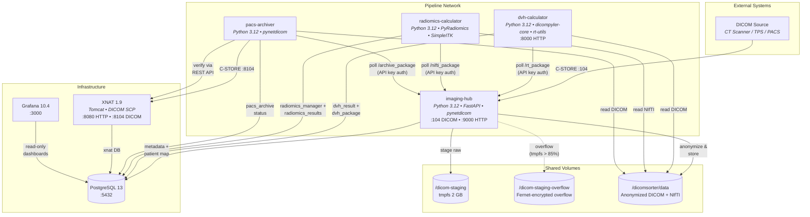
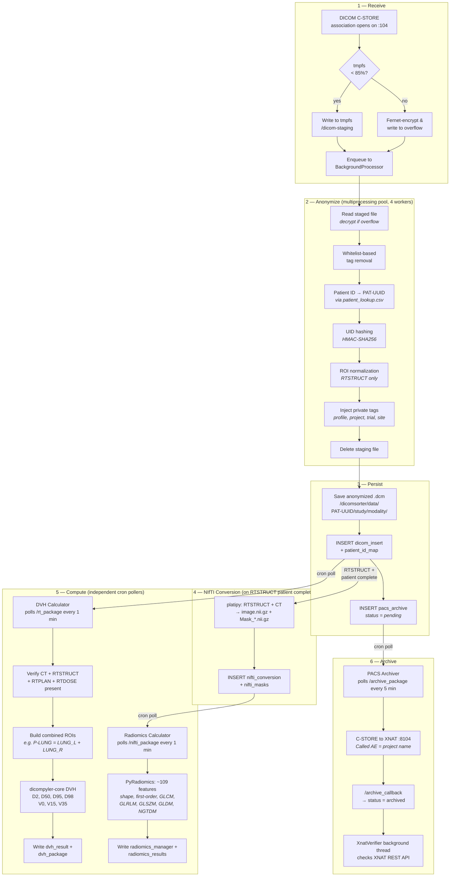
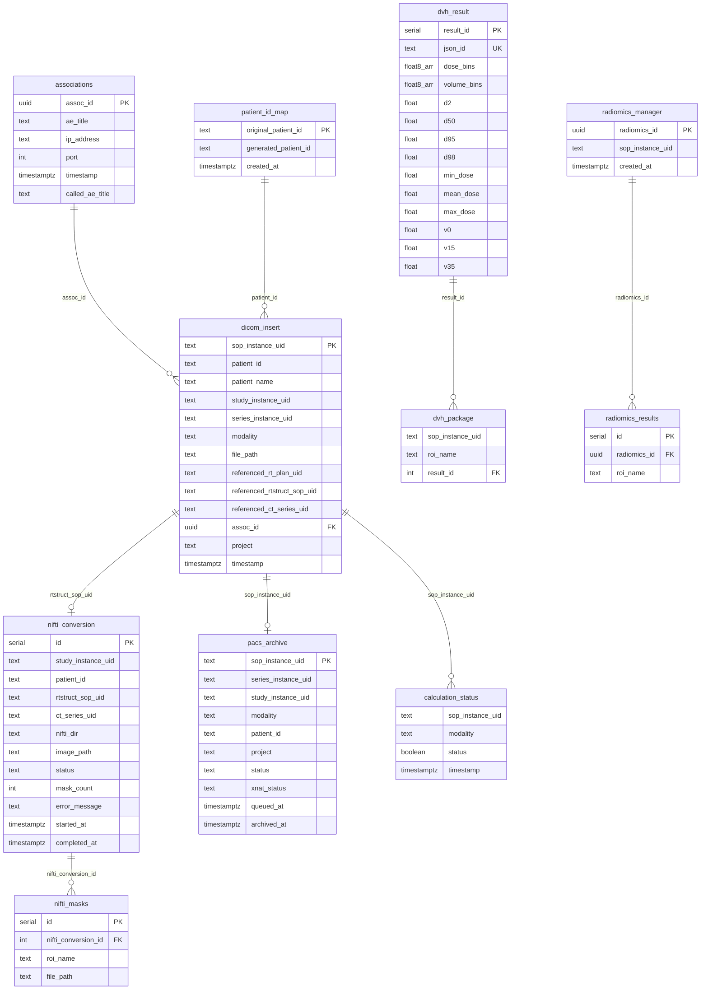

# Architecture Diagrams

## System Architecture

```mermaid
graph TB
    subgraph external["External Systems"]
        PACS_SRC["DICOM Source<br/><i>CT Scanner / TPS / PACS</i>"]
    end

    subgraph pipeline["Pipeline Network"]
        HUB["imaging-hub<br/><i>Python 3.12 &bull; FastAPI &bull; pynetdicom</i><br/>:104 DICOM &bull; :9000 HTTP"]
        DVH["dvh-calculator<br/><i>Python 3.12 &bull; dicompyler-core &bull; rt-utils</i><br/>:8000 HTTP"]
        RAD["radiomics-calculator<br/><i>Python 3.12 &bull; PyRadiomics &bull; SimpleITK</i>"]
        ARC["pacs-archiver<br/><i>Python 3.12 &bull; pynetdicom</i>"]
    end

    subgraph infra["Infrastructure"]
        PG[("PostgreSQL 13<br/>:5432")]
        XNAT["XNAT 1.9<br/><i>Tomcat &bull; DICOM SCP</i><br/>:8080 HTTP &bull; :8104 DICOM"]
        GF["Grafana 10.4<br/>:3000"]
    end

    subgraph storage["Shared Volumes"]
        TMPFS[("/dicom-staging<br/>tmpfs 2 GB")]
        OVERFLOW[("/dicom-staging-overflow<br/>Fernet-encrypted overflow")]
        DATA[("/dicomsorter/data<br/>Anonymized DICOM + NIfTI")]
    end

    PACS_SRC -- "C-STORE :104" --> HUB
    HUB -- "stage raw" --> TMPFS
    HUB -. "overflow<br/>(tmpfs > 85%)" .-> OVERFLOW
    HUB -- "anonymize &<br/>store" --> DATA
    HUB -- "metadata +<br/>patient map" --> PG

    DVH -- "poll /rt_package<br/>(API key auth)" --> HUB
    DVH -- "read DICOM" --> DATA
    DVH -- "dvh_result +<br/>dvh_package" --> PG

    RAD -- "poll /nifti_package<br/>(API key auth)" --> HUB
    RAD -- "read NIfTI" --> DATA
    RAD -- "radiomics_manager +<br/>radiomics_results" --> PG

    ARC -- "poll /archive_package<br/>(API key auth)" --> HUB
    ARC -- "read DICOM" --> DATA
    ARC -- "C-STORE :8104" --> XNAT
    ARC -- "verify via<br/>REST API" --> XNAT
    ARC -- "pacs_archive<br/>status" --> PG

    XNAT -- "xnat DB" --> PG
    GF -- "read-only<br/>dashboards" --> PG
```

## Data Flow

Shows the journey of a DICOM study from receipt through all processing stages.

```mermaid
flowchart TD
    subgraph receive["1 &mdash; Receive"]
        A1["DICOM C-STORE<br/>association opens on :104"]
        A2{"tmpfs<br/>< 85%?"}
        A3["Write to tmpfs<br/>/dicom-staging"]
        A4["Fernet-encrypt &<br/>write to overflow"]
        A5["Enqueue to<br/>BackgroundProcessor"]
    end

    subgraph anon["2 &mdash; Anonymize (multiprocessing pool, 4 workers)"]
        B1["Read staged file<br/><i>decrypt if overflow</i>"]
        B2["Whitelist-based<br/>tag removal"]
        B3["Patient ID &rarr; PAT-UUID<br/><i>via patient_lookup.csv</i>"]
        B4["UID hashing<br/><i>HMAC-SHA256</i>"]
        B5["ROI normalization<br/><i>RTSTRUCT only</i>"]
        B6["Inject private tags<br/><i>profile, project, trial, site</i>"]
        B7["Delete staging file"]
    end

    subgraph persist["3 &mdash; Persist"]
        C1["Save anonymized .dcm<br/>/dicomsorter/data/<br/>PAT-UUID/study/modality/"]
        C2["INSERT dicom_insert<br/>+ patient_id_map"]
        C3["INSERT pacs_archive<br/><i>status = pending</i>"]
    end

    subgraph convert["4 &mdash; NIfTI Conversion (on RTSTRUCT patient complete)"]
        N1["platipy: RTSTRUCT + CT<br/>&rarr; image.nii.gz + Mask_*.nii.gz"]
        N2["INSERT nifti_conversion<br/>+ nifti_masks"]
    end

    subgraph compute["5 &mdash; Compute (independent cron pollers)"]
        D1["DVH Calculator<br/>polls /rt_package every 1 min"]
        D2["Verify CT + RTSTRUCT<br/>+ RTPLAN + RTDOSE present"]
        D3["Build combined ROIs<br/><i>e.g. P-LUNG = LUNG_L + LUNG_R</i>"]
        D4["dicompyler-core DVH<br/>D2, D50, D95, D98<br/>V0, V15, V35"]
        D5["Write dvh_result +<br/>dvh_package"]

        R1["Radiomics Calculator<br/>polls /nifti_package every 1 min"]
        R2["PyRadiomics: ~109 features<br/><i>shape, first-order, GLCM,<br/>GLRLM, GLSZM, GLDM, NGTDM</i>"]
        R3["Write radiomics_manager +<br/>radiomics_results"]
    end

    subgraph archive["6 &mdash; Archive"]
        E1["PACS Archiver<br/>polls /archive_package every 5 min"]
        E2["C-STORE to XNAT :8104<br/><i>Called AE = project name</i>"]
        E3["/archive_callback<br/>&rarr; status = archived"]
        E4["XnatVerifier background thread<br/>checks XNAT REST API"]
    end

    A1 --> A2
    A2 -- "yes" --> A3
    A2 -- "no" --> A4
    A3 --> A5
    A4 --> A5

    A5 --> B1 --> B2 --> B3 --> B4 --> B5 --> B6 --> B7

    B7 --> C1 --> C2 --> C3

    C2 -- "RTSTRUCT +<br/>patient complete" --> N1 --> N2

    C2 -- "cron poll" --> D1 --> D2 --> D3 --> D4 --> D5
    N2 -- "cron poll" --> R1 --> R2 --> R3
    C3 -- "cron poll" --> E1 --> E2 --> E3
    E3 --> E4
```

## Module Overview

```mermaid
graph TB
    subgraph common["packages / imaging-common"]
        CFG["config.py<br/><i>ImagingSettings, PostgresSettings,<br/>AnonymizationSettings (Pydantic)</i>"]
        PGI["database.py<br/><i>PostgresInterface<br/>thread-safe, auto-reconnect</i>"]
        POLL["poller.py<br/><i>APIPoller<br/>croniter + ThreadPoolExecutor</i>"]
        XNAT_UP["xnat.py<br/><i>XNATUploader<br/>file upload + session wait</i>"]
    end

    subgraph hub["services / imaging-hub"]
        MAIN_H["__main__.py<br/><i>DICOM AE listener + uvicorn</i>"]
        SET_H["settings.py<br/><i>BASE_DIR, USE_NIFTI,<br/>STAGING_* env vars</i>"]
        SH["store_handler.py<br/><i>DicomStoreHandler<br/>C-STORE callback</i>"]
        BP["background_processor.py<br/><i>BackgroundProcessor<br/>multiprocessing.Pool (fork, 4w)</i>"]
        ANON["anonymization/anonymizer.py<br/><i>Anonymizer: whitelist removal,<br/>UID hashing, ROI normalization</i>"]
        STG["staging.py<br/><i>StagingManager<br/>tmpfs + Fernet overflow</i>"]
        AT["association_tracker.py<br/><i>AssociationTracker<br/>per-assoc / per-patient counters</i>"]
        NIFTI["nifti_converter.py<br/><i>NiftiConverter<br/>ProcessPoolExecutor (2w), platipy</i>"]
        API["api.py<br/><i>FastAPI: /rt_package, /nifti_package,<br/>/archive_package, /archive_callback</i>"]
        DD["dicom_data.py<br/><i>return_dicom_data(), create_folder()</i>"]
        QR["queries.py<br/><i>DDL tables, migrations,<br/>INSERT templates</i>"]
    end

    subgraph dvh["services / dvh-calculator"]
        MAIN_D["__main__.py<br/><i>poller thread + FastAPI :8000</i>"]
        DVHP["dvh_processor.py<br/><i>process_message: bundle &rarr; DVH</i>"]
        BUNDLE["DVH/dicom_bundle.py<br/><i>DicomBundle dataclass</i>"]
        DVHC["DVH/dvh.py<br/><i>DVHCalculation<br/>dicompyler-core</i>"]
        OUT["DVH/output.py<br/><i>JSON-LD serialization</i>"]
        ROIH["roi_handler.py<br/><i>combine_rois via rt-utils</i>"]
        PGDVH["postgres_dvh.py<br/><i>PostgresUploader<br/>dvh_result + dvh_package</i>"]
        GVAR["Config/global_var.py<br/><i>UPLOAD_DESTINATION</i>"]
    end

    subgraph rad["services / radiomics-calculator"]
        MAIN_R["__main__.py<br/><i>RadiomicsPipeline + poller</i>"]
        RC["radiomics_calculator.py<br/><i>RadiomicsCalculator<br/>SimpleITK + PyRadiomics</i>"]
        RPDB["radiomics_results_postgress.py<br/><i>send_postgress, setup_radiomics_db</i>"]
    end

    subgraph arc["services / pacs-archiver"]
        MAIN_A["__main__.py<br/><i>poller + XnatVerifier</i>"]
        SEND["sender.py<br/><i>DICOMtoPACS<br/>pynetdicom C-STORE</i>"]
        VER["verifier.py<br/><i>XnatVerifier<br/>background thread, REST checks</i>"]
    end

    %% imaging-hub internal
    MAIN_H --> SH
    MAIN_H --> API
    MAIN_H --> NIFTI
    MAIN_H --> QR
    SH --> BP
    SH --> STG
    SH --> AT
    BP --> ANON
    BP --> DD
    BP --> STG
    SH --> SET_H

    %% dvh-calculator internal
    MAIN_D --> DVHP
    DVHP --> BUNDLE
    DVHP --> DVHC
    DVHP --> OUT
    DVHP --> ROIH
    DVHP --> PGDVH
    DVHP --> GVAR

    %% radiomics-calculator internal
    MAIN_R --> RC
    MAIN_R --> RPDB

    %% pacs-archiver internal
    MAIN_A --> SEND
    MAIN_A --> VER

    %% shared library usage
    MAIN_H -.-> PGI
    MAIN_H -.-> CFG
    API -.-> PGI
    NIFTI -.-> PGI
    MAIN_D -.-> POLL
    PGDVH -.-> PGI
    DVHP -.-> PGI
    MAIN_R -.-> POLL
    MAIN_R -.-> XNAT_UP
    RPDB -.-> PGI
    MAIN_A -.-> POLL
    MAIN_A -.-> PGI
```

## Database Schema

```mermaid
erDiagram
    associations {
        uuid assoc_id PK
        text ae_title
        text ip_address
        int port
        timestamptz timestamp
        text called_ae_title
    }

    patient_id_map {
        text original_patient_id PK
        text generated_patient_id
        timestamptz created_at
    }

    dicom_insert {
        text sop_instance_uid PK
        text patient_id
        text patient_name
        text study_instance_uid
        text series_instance_uid
        text modality
        text file_path
        text referenced_rt_plan_uid
        text referenced_rtstruct_sop_uid
        text referenced_ct_series_uid
        uuid assoc_id FK
        text project
        timestamptz timestamp
    }

    nifti_conversion {
        serial id PK
        text study_instance_uid
        text patient_id
        text rtstruct_sop_uid
        text ct_series_uid
        text nifti_dir
        text image_path
        text status
        int mask_count
        text error_message
        timestamptz started_at
        timestamptz completed_at
    }

    nifti_masks {
        serial id PK
        int nifti_conversion_id FK
        text roi_name
        text file_path
    }

    pacs_archive {
        text sop_instance_uid PK
        text series_instance_uid
        text study_instance_uid
        text modality
        text patient_id
        text project
        text status
        text xnat_status
        timestamptz queued_at
        timestamptz archived_at
    }

    calculation_status {
        text sop_instance_uid
        text modality
        boolean status
        timestamptz timestamp
    }

    dvh_result {
        serial result_id PK
        text json_id UK
        float8_arr dose_bins
        float8_arr volume_bins
        float d2
        float d50
        float d95
        float d98
        float min_dose
        float mean_dose
        float max_dose
        float v0
        float v15
        float v35
    }

    dvh_package {
        text sop_instance_uid
        text roi_name
        int result_id FK
    }

    radiomics_manager {
        uuid radiomics_id PK
        text sop_instance_uid
        timestamptz created_at
    }

    radiomics_results {
        serial id PK
        uuid radiomics_id FK
        text roi_name
    }

    associations ||--o{ dicom_insert : "assoc_id"
    patient_id_map ||--o{ dicom_insert : "patient_id"
    dicom_insert ||--o| pacs_archive : "sop_instance_uid"
    dicom_insert ||--o| nifti_conversion : "rtstruct_sop_uid"
    nifti_conversion ||--o{ nifti_masks : "nifti_conversion_id"
    dicom_insert ||--o{ calculation_status : "sop_instance_uid"
    dvh_result ||--o{ dvh_package : "result_id"
    radiomics_manager ||--o{ radiomics_results : "radiomics_id"
```
